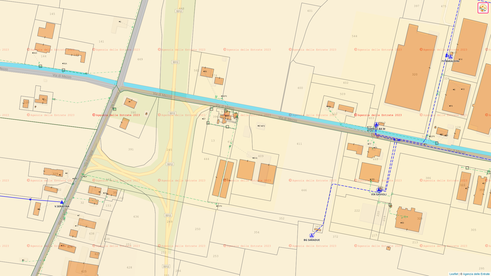

# Catasto in PUC                 

Made by [Ruslan Dzyuba](https://github.com/Trorker)

Semplifica l'accesso alle Mappe Catastali
=========================================

Scopri come il nostro script rende facile l'accesso alle mappe catastali su PUC.
--------------------------------------------------------------------------------

 

Mappe catastali integrate
-------------------------

Un vantaggio per la prevenzione e lo sviluppo della rete elettrica.

Le mappe catastali sono un'importante risorsa per una varietà di attività, tra cui la prevenzione e lo sviluppo della rete elettrica. Tuttavia, accedere a queste mappe può essere un processo complesso che richiede l'utilizzo di diverse applicazioni o siti web.

Per risolvere questo problema, è stato sviluppato questo progetto per l'integrazione delle mappe catastali nella piattaforma PUC. Questo script consente di visualizzare e consultare le mappe catastali direttamente dalla piattaforma PUC, eliminando la necessità di passare a diversi programmi o siti web.

> "La tecnologia, quando è ben concepita e ben implementata, semplifica la vita."
> 
> \- ChatCPT

###### Follow Us

*   
*   
*   

###### Useful Links

*   [Per i più Curiosi](for-the-curious.html)
*   [GitHub Repository](https://github.com/Trorker/Catasto-in-PUC)

###### Support

*   [Code licensed MIT](license.html)

* * *

Made by [Ruslan Dzyuba](https://github.com/Trorker)  
Copyright © 2023 - All rights reserved
